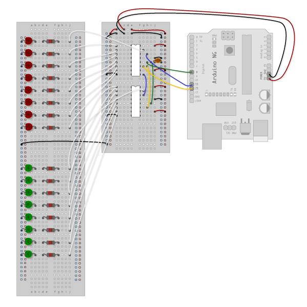

# LED signal control using JMRI, C/MRI, and 74HC595 shift registers

The 74HC595 shift register provides 8 outputs from the use of only three digital pins on an Arduino. Multiple 74HC595 shift registers can be chained together, and still only consume three digital pins on an Arduino.

Using 74HC595 shift registers, you can connect multiple LEDs to represent signal heads for model railways. LEDs connected to a 74HC595 shift register can share a common ground to minimize wiring that runs to signal heads. This approach is an advantage to alternatives such as the TLC5947 24-channel or TLC59711 12-channel PWM LED driver boards that are constant current sinks and require each LED to have their own individual positive and negative terminal connection.

Cost-wise, the 74HC595 shift registers are less than US $0.50 each - [https://www.amazon.com/s?k=74HC595](https://www.amazon.com/s?k=74HC595). Each shift register also needs 8 resistors (I used 1k Ohm resistors). Resistors in bulk end up US $0.05/each - [https://www.amazon.com/s?k=1k+ohm+resistor](https://www.amazon.com/s?k=1k+ohm+resistor). Overall, it's about US $1 for 8 outputs, enough to drive four 2-aspect signals. Very cost effective.


### JMRI and C/MRI

JMRI [http://www.jmri.org/](http://www.jmri.org/) is the Java Model Railroad Interface, a computed-based set of graphical tools to control and manage a model railroad. Steve Todd has an easy way to get started running JMRI on a Raspberry Pi with minimal configuration - [https://mstevetodd.com/jmri-raspberrypi-access-point](https://mstevetodd.com/jmri-raspberrypi-access-point).

C/MRI is the Computer Model Railroad Interface, a long-running project that defines a means for a computer to communicate with a model railroad - [http://jmri.org/help/en/html/hardware/cmri/CMRI.shtml](http://jmri.org/help/en/html/hardware/cmri/CMRI.shtml). C/MRI provides a minimalistic way to communicate and send data to control a model railroad, such as signal lights.

In the approach outlined here, JMRI is the primary control tool to manage the railroad DCC operations and to set routes and throw turnouts. C/MRI is used to provide a simple way to set the status of LEDs connected to 74HC595 shift registers through to an Arduino.

## Connecting shift registers to an Arduino

The core Arduino.cc tutorial for ShiftOut details the wiring diagrams for the use of the 74HC595 shift register - [https://www.arduino.cc/en/Tutorial/ShiftOut](https://www.arduino.cc/en/Tutorial/ShiftOut). The following diagrams are for a single 74HC595 shift register:

**Breadboard diagram**


**Circuit diagram**


### Additional shift registers

You add additional shift 74HC595 shift registers by chaining serial out pin 9 on the previous shift 74HC595 shift register to serial input pin 14 of the next 74HC595 shift register. The same clock and latch connections on the digital pins on the Arduino are used. Again, the core Arduino.cc tutorial for ShiftOut provides some additional context. The following diagrams are for two 74HC595 shift registers:

**Breadboard diagram**



**Circuit diagram**


## Compile sketch and upload to Arduino

Download and open the *stationSignals/stationSignals.ino* sketch in the Arduino IDE, then connect your Arduino board. You need to install the following two libraries by Michael Adams to allow the Arduino to communicate with CMRI:

* ArduinoCMRI - [https://github.com/madleech/ArduinoCMRI](https://github.com/madleech/ArduinoCMRI#installation)
* Auto485 - [https://github.com/madleech/Auto485](https://github.com/madleech/Auto485#installation)

With the libraries installed, verify you have the correct board type and COM port selected for your Arduino, then compile and upload the sketch.

```arduino
// Add includes for CMRI (https://github.com/madleech/ArduinoCMRI)
// and AutoRS485 (https://github.com/madleech/Auto485)
// Make sure these are installed in your Arduino library
#include <CMRI.h>
#include <Auto485.h>

// Intialize communications for CMRI
// Defaults to a CMRI node at address 1 with 24 inputs and 48 outputs
#define CMRI_ADDR 1
#define DE_PIN 2
Auto485 bus(DE_PIN);
CMRI cmri(CMRI_ADDR, 24, 48, bus);

// Configure shift register communication
// Set these to the pins in use on your own Arduino
const int clockPin = 8; // yellow wire
const int latchPin = 9; // green wire
const int dataPin = 10; // blue wire

void setup() {
  Serial.begin(9600, SERIAL_8N2);

  // Set the shift register pins as output
  pinMode(latchPin, OUTPUT);
  pinMode(dataPin, OUTPUT);  
  pinMode(clockPin, OUTPUT);
}

void loop() {
  // Start a CMRI process
  cmri.process();
 
  // Set to latch to low before shifting out the data
  digitalWrite(latchPin, LOW);

  // Get the data from CMRI, then shift out the data to each register
  // The registers are shifted out in reverse - that is, the fourth
  // register (3) gets shifted out, then the third register (2), etc.
  //
  // This approach pushes the data out to each register as it goes
  // Update these lines for however many registers you actually have
  shiftOut(dataPin, clockPin, MSBFIRST, cmri.get_byte(3));
  shiftOut(dataPin, clockPin, MSBFIRST, cmri.get_byte(2));
  shiftOut(dataPin, clockPin, MSBFIRST, cmri.get_byte(1));
  shiftOut(dataPin, clockPin, MSBFIRST, cmri.get_byte(0));

  // Once all the data has been shifted out, set the latch to high to finalize
  digitalWrite(latchPin, HIGH);
}
```

Once compiled and running on your board, the default state is that no LEDs will be illuminated. Don't worry that nothing lights up! The LEDs will likely flash when the sketch first runs to indicate they are at least wired correctly. There's no connection to CMRI to receive the status of the signals and set the appropriate LEDs, which we configure in the next step.

## Configure C/MRI in JMRI

You need JMRI already set up and configured before you can add in C/MRI control. If needed, Steve Todd has an easy way to get started running JMRI on a Raspberry Pi with minimal configuration - [https://mstevetodd.com/jmri-raspberrypi-access-point](https://mstevetodd.com/jmri-raspberrypi-access-point).

To configure C/MRI:

* In JMRI Panel Pro, select **Edit | Preferences**.
* On the **Connections** window, chose to add a new connection. Select *C/MRI* as the **System manufacturer**, then *Serial* as the **System connection**. Under **Serial port**, select the USB connection for your Arduino, such as */dev/ttyACM0*.
* Enter a **Connection** name, such as *Arduino*, and leave the **Connection prefix** as *C*.
* Select **Configure C/MRI nodes**. Under **Node Address**, enter *1*, then select **Done**.
* Save the configuration, and restart JMRI when prompted.

In the previous steps, a C/MRI node at address *1* was addedd. This matches what is defined in the Arduino sketch for `#define CMRI_ADDR 1`. If you expand your system and add more Arduino nodes, add a C/MRI node in JMRI with the apppropriate address, such as *2* or *3*, and update the Arduino sketch accordingly.

Now add some lights in JMRI that use the C/MRI system connection:

* In JMRI Panel Pro, select **Tools | Tables | Lights**.
* Select your C/MRI sysem connection created in the previous section, then enter a **Hardware address**. Start out with *1001* as the first light, then *1002*, *1003*, etc.
* Under **User name** for each light, enter a human-readable name, such as *PLATFORM-8-SOUTH-GREEN* for hardware address *1001*, then *PLATFORM-8-SOUTH-RED* for hardware address *1002*, etc.
* The 8 outputs on the first 74HC595 shift register are C/MRI hardware addresses 1001-1008. The 8 outputs on the second 74HC595 shift register are C/MRI hardware addresses 1009-1016. This pattern continues for each 74HC595 shift register you add, so C/MRI hardware addresses 1017-1024 for the next, and so on.
* After adding the required lights, from the list of lights, now toggle the light **On** or **Off**. C/MRI should set the appropriate bit which is then shifted out by the Arduino to the 74HC595 shift register(s).

You can **Add control** actions to each C/MRI light that corresponds to a turnout status or sensor status. This adds the automated level of control for JMRI to adjust the signals as conditions on the model railroad dictate.

## Controlling signals using JMRI routes and internal sensors

A light in JMRI can have control actions associated with it. For basic operations, you can set the LED to be on or off based on the state of a turnout. For more complex operations, you can use internal sensors and routes in JMRI to control the LED status. This is how I control things on my layout as I use routes to set the state of multiple turnouts.

At a high level:

* Create a sensor in JMRI of type *Internal*, and give it a name, such as *1001*. This internal sensor reads no actual data from a physical sensor, but is used to track the active or inactive state for a route.
* Create a route in JMRI, such as *PLATFORM-8-DEPT-SOUTH*. Select the turnouts to be included in the route and the appropriate closed or thrown status.
* In the route options, under **Sensor that Activates when all Route Turnouts are correctly aligned**, select the internal sensor created in the first step, such as *IS1001*.
* Choose to **Create new** route, then from the list of routes, toggle the state of the route using the **Set** button. The internal sensor state should update to *Active* or *Inactive* as the route is set or not.
* Now select one of your lights in JMRI that was created as a C/MRI light. Choose to **Add control**.
* For a green light, set the **Control type** to *By sensor*, then enter your internal sensor name, such as *IS1001*. Set the state to *Active*. Now, when the route is set and the internal sensor is set to active, the LED will light.
* Repeat for the red light as part of the signal head, this time choosing *Inactive* as the sensor state. As the route is set, the green LED is turned. When the route is not set, the red LED is turned on. These states are shifted out by the Arduino to the 74HC595 shift register(s).

## YouTube video

On my YouTube channel for Newcastle Central (OO gauge), I cover over how I put all of this together to end up with usable signal control using JMRI and C/MRI. It's a balance between the written word and seeing it in action through video. Hopefully they complement each other:

[](http://www.youtube.com/watch?v=sdKwI6FjEvc "36 - Signal lights using JMRI with an Arduino and C/MRI ")
